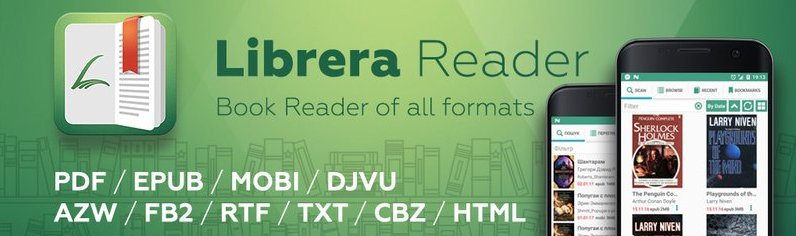
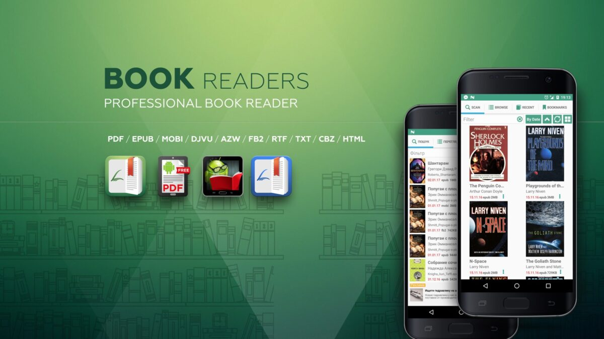
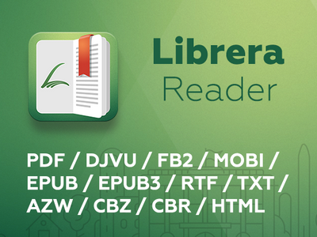

# Librera Reader

Librera Reader is an Android book app that keeps a library and a page in the same place. You point it at a folder, it finds PDF, EPUB, FB2, and the rest, and you read. Librera Pro is the same reader with the extras that need a paid build: Drive sync, a wider tool set, the package id people search as com foobnix pro pdf reader.

This file is the handbook for that pair. It covers Librera Reader android, Librera Reader apk, Librera Reader fdroid, Librera Reader for pc questions, and the formats people type into search: Librera Reader pdf, Librera Reader epub, Librera Reader opds.

Librera Reader is not a storefront and it is not a cloud locker. The book file stays on the device unless you turn sync on in Librera Pro. Librera Reader for windows and Librera Reader for pc are the usual "how do I run the phone app on a desktop" questions. The product you install first is the Android build. A desktop wrapper is a different package, when one exists.

## Editions

Two builds share the same reading core.

| Build | What you get |
| --- | --- |
| Librera Reader | Library scan, reader, TTS, musician mode, OPDS, the format list below |
| Librera Pro | The same reader plus sync and the paid extras |
| Librera Reader fdroid | An F-Droid package without Play services. Search also hits com foobnix pro pdf reader |

Librera Reader apk and Librera Pro apk should come from a store or a release you can name. A random Librera Reader pro apk on a file host is how people install the wrong signature.

Librera Reader open source is the public tree. Librera Pro is the product name for the paid flavor of that tree, not a second engine.

## Features

Librera Reader features that stay in daily use:

- A library that scans folders, tags books, and sorts by author or title. Grid or list.
- Librera pdf reader and EPUB views in one app, not two viewers you switch between.
- Librera Reader text to speech through the TTS engine already on the phone, with media controls.
- Librera Reader musician mode: hands-free auto-scroll for scores, speed you set.
- Day and night themes, fonts, margins, custom CSS.
- Bookmarks, highlights, dictionary lookups.
- Librera Reader opds catalogs for network shelves.
- Librera Pro Google Drive sync for progress and files when you turn it on.

The page view is the job. If a control does not help you finish the chapter, it does not belong on the first screen.

## Supported formats

Librera Reader supported formats, the ones the handbook treats as first-class:

| Kind | Extensions |
| --- | --- |
| Documents and ebooks | PDF, EPUB, EPUB3, MOBI, DjVu, FB2, TXT, RTF, AZW, AZW3, HTML, DOC, DOCX |
| Comics and archives | CBZ, CBR, ZIP, RAR |
| Catalogs | OPDS |

A file that only looks like a book (a scanned image in a random container) may still open and may still page badly. Prefer a clean EPUB or a searchable PDF when you have the choice.

## Download

Take one Librera Reader apk from a channel you can name: Play, F-Droid, or a tagged GitHub release. Match the flavor to the store.

- Librera Reader android on Play for the free listing.
- Librera Pro / Librera Reader pro on the paid listing.
- Librera Reader fdroid when you want the build without Google services.

Keep the previous apk until the new one has opened one book you already trust. Beta packages exist. They are a poor default on a shared tablet.

Librera Reader official website is the place to confirm the current version number. Do not trust a page that only copies the name.

## Installation

### Android

1. Install the apk or the store listing that matches the edition.
2. Grant storage or all-files access if the library must see folders outside the app sandbox.
3. Point the scan at the directory where you keep books. Wait for the first pass.
4. Open one EPUB and one PDF before you import a whole shelf.

Librera Reader android needs a current enough system for the build you picked. Old API floors are listed next to each release tag. If the installer refuses, you are on a build that no longer supports that OS.

### Windows and PC

Librera Reader windows, Librera Reader for windows, and Librera Reader for pc show up because people want the phone library on a desktop. This project is an Android reader first. If a desktop or web build is published later, treat it as a separate download. Do not sideload a phone apk on Windows and call that the official desktop app.

## Running

Open the app. The first screen is the library. The second is the book.

A first hour that stays small:

1. Scan one folder, not the whole storage tree.
2. Open a short EPUB. Set font and night mode.
3. Try Librera Reader text to speech on a page you do not mind hearing.
4. If you read scores, turn on Librera Reader musician mode and set a slow scroll.
5. Add one OPDS catalog only after local files already open.

If a book is in the folder but missing from the grid, rescan. If it is in the grid and blank on open, the file is damaged or the format is only half supported. Try another copy before you file a bug.

## Text to speech and musician mode

Librera Reader text to speech uses whatever engine the device already has. Install a voice pack in system settings if the default voice is empty or wrong. The in-app player starts, pauses, and skips. It does not invent a new TTS engine.

Librera Reader musician mode is for pages you cannot turn with a hand on an instrument. Auto-scroll is a timer, not a beat tracker. Set the speed on a copy of the score before a rehearsal.

## OPDS and sync

Librera Reader opds talks to a catalog URL. You browse, you download, the file lands in the library. A dead catalog is a network or URL problem, not a missing font.

Librera Pro sync is optional. Turn it on when two devices should share progress. Leave it off when the tablet is a one-device shelf. A free Librera Reader build will not grow a Drive button just because you renamed the apk.

## Building from source

You do not need a local build to read. You need one to change the app.

Outline that matches the public tree:

1. Android Studio, a recent NDK, Gradle.
2. A PKCS12 keystore in `gradle.properties` even for a local release assemble.
3. Link the MuPDF tree the Builder scripts expect, then `assembleLibrera` or `assembleFdroid`.
4. F-Droid flavor skips Play Firebase files. A Play flavor expects `google-services.json` if that module is enabled.

Do not mix a Play signing key with an F-Droid package name. The system will treat them as two apps.

## Documentation

Pages that belong next to this file:

- Librera Reader supported formats and known weak files
- Librera Reader text to speech voices
- Librera Reader musician mode speed
- Librera Reader opds catalog URLs
- Librera Pro sync, what is uploaded
- Storage permission on current Android

Write a page when the same question appears twice.

## Troubleshooting

- Blank PDF: try another renderer setting if the build exposes one, then another file.
- TTS silent: check system TTS, not only the in-app toggle.
- Library empty after upgrade: confirm the scan folder survived scoped storage.
- Librera Reader editing or notes missing: you are in a format that only paginates, or you are not in Librera Pro where that tool lives.
- Two icons after install: you installed both the free listing and Librera Pro. That is two package ids.

## Feedback

A useful report has the app version, Android version, the file format, and whether the same file opens in a second reader. A screenshot of the library grid is enough for a scan bug. A full book attachment is not, unless the maintainer asks.

## Architecture

Librera Reader is a native Android app. The window you tap is Java and Kotlin UI. The page you see is a document engine (MuPDF and the format loaders next to it). TTS is a bridge to the system voice. Librera Reader opds is a network client, not a second library database.

That split is why a crash on open is usually a file or a renderer, and a silent voice is usually the system TTS pack. Librera Pro sync sits above both: it copies progress and, when you allow it, files. It does not replace the local scan.

Librerareader as one word in search is this same tree. There is not a second engine under that spelling.

## First week

Day one, ignore Librera Reader for pc and a pile of catalogs.

1. Install from a named store or a tagged Librera Reader apk.
2. Scan one folder of books you already opened elsewhere.
3. Read a short Librera Reader epub and one Librera Reader pdf.
4. Set night mode and a font you can stand for twenty minutes.
5. Only then turn on Librera Reader text to speech or Librera Reader musician mode.

Pin the free Librera Reader until a missing sync path forces a look at Librera Pro. Keep the old apk until the new one has finished one book.

## Questions that show up early

### Is Librera Reader only for Android?

Yes, as the app this handbook describes. Librera Reader windows and Librera Reader for windows are search lines, not a second official desktop binary in this tree.

### Do I need Librera Pro to read EPUB and PDF?

No. Librera pdf reader and Librera Reader epub work in the free build. Librera Pro is for sync and the paid extras.

### Where should a Librera Reader apk come from?

Play, F-Droid, or a release tag. A Librera Reader pro apk from an unnamed host is a different signature risk.

### Can I run the same library on two phones?

Local copies: copy the folder. Progress across devices: Librera Pro sync, when you turn it on.

## License

The public tree is open source under the license file in the repository. Librera Pro listing terms are the store terms for that package. Your ebook files stay under whatever license you already had. Opening a PDF in Librera Reader does not relicense the book.

## Related Search Terms

librera reader, librera pro, librera pro apk, librera reader apk, librera apk, librera reader pro apk, librera reader pro, librera pdf reader, librera android, librera reader for pc, librera reader android, librerareader, librera book reader, librera reader windows, librera reader for windows, com foobnix pro pdf reader, librera reader fdroid, librera reader pdf, librera reader epub, librera reader official website
